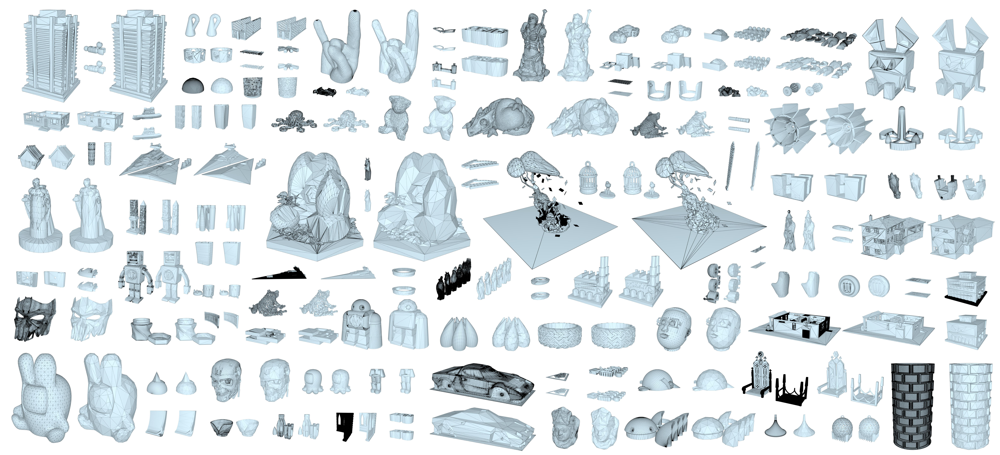

# Robust Low-Poly Meshing for General 3D Models
**Zhen Chen<sup>1,2</sup>, Zherong Pan<sup>1</sup>, Kui Wu<sup>1</sup>, Etienne Vouga<sup>2</sup>, Xifeng Gao<sup>1</sup>**

<sup>1</sup>Lightspeed Studios, <sup>2</sup>Univeristy of Texas at Austin

*ACM Transactions on Graphics (SIGGRAPH), 2023*


[Paper](paper/Robust_Self_Collision_Free_Remeshing.pdf) [Program](exe/RoLoPM_Release.zip)

## Abstract
<p style="text-align: justify;">
We propose a robust re-meshing approach that can automatically generate visual-preserving low-poly meshes for any high-poly models found in the wild. Our method can be seamlessly integrated into current mesh-based 3D asset production pipelines. Given an input high-poly, our method proceeds in two stages: 1) Robustly extracting an offset surface mesh that is feature-preserving, and guaranteed to be watertight, manifold, and self-intersection free; 2) Progressively simplifying and flowing the offset mesh to bring it close to the input. The simplicity and the visual-preservation of the generated low-poly is controlled by a user-required target screen size of the input: decreasing the screen size reduces the element count of the low-poly but enlarges its visual difference from the input. We have evaluated our method on a subset of the Thingi10K dataset that contains models created by practitioners in different domains, with varying topological and geometriccomplexities. Compared to state-of-the-art approaches and widely used software, our method demonstrates its superiority in terms of the element count, visual preservation, geometry, and topology guarantees of the generated low-polys.
</p>

## News
Our surface remeshing exe is released! Check [here](exe/RoLoPM_Release.zip) for details. 

## Run Exe
To execute our executable file, follow these steps:

```
./SurfaceRemeshingCli_bin.exe -i "YourObjMeshFile.obj" -n 100
```

Here's what each option means:

- The `-i` flag specifies the input mesh file in .obj format.
- The `-n` flag allows you to adjust precision. A higher number yields a more precise result but consumes more time and memory. Please note that the current version supports a maximum precision level of `-n 400`.

For more detailed information about available parameters, you can run:

```
./SurfaceRemeshingCli_bin.exe -h
```

This command will provide you with comprehensive details on the available options and their usage.


## License
To be updated.
